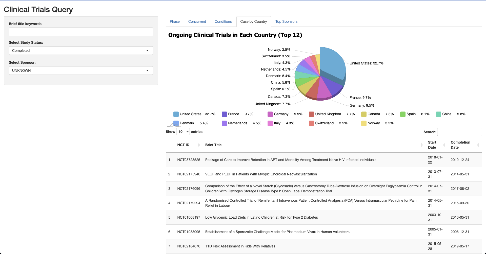
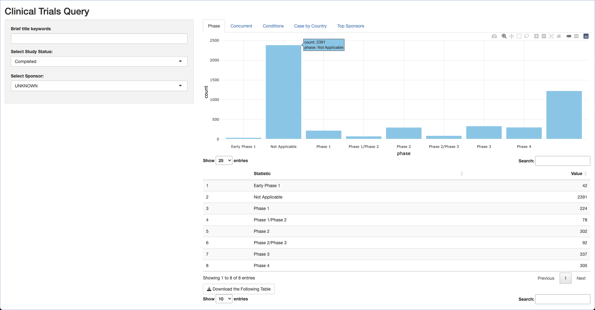
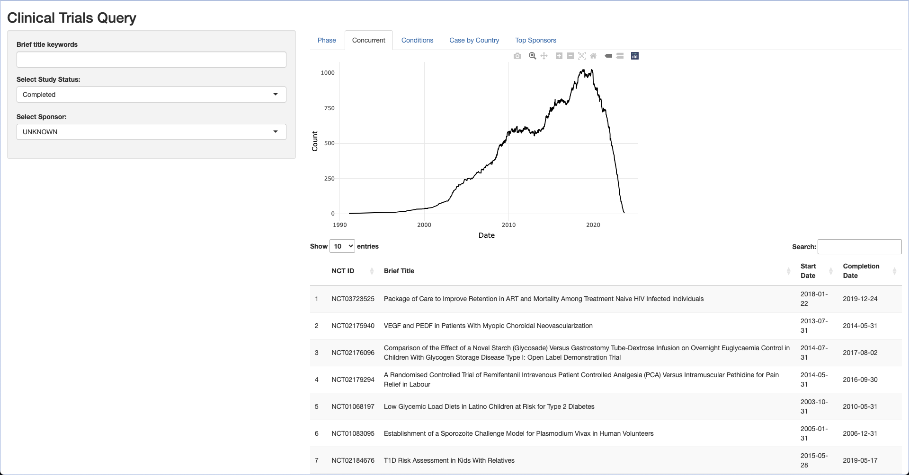

<!-- README.md is generated from README.Rmd. Please edit that file -->

# bis620.2022

<!-- badges: start -->

[](https://github.com/bluetex315/bis620.2022/actions/workflows/R-CMD-check.yaml)

<!-- badges: end -->

The goal of BIS620.2023 is to create a shiny app that explores relationships between variables in the clinical trail dataset. Functions that explore the phase feature and concurrent feature are all included. More features that allow user to download the app and explore summary statistics, or even interactive plot that allow users to explore the relationships between diagrams are included. 

## Installation

You can install the development version of bis620.2022 from
[GitHub](https://github.com/) with:

``` r
# install.packages("devtools")
devtools::install_github("bluetex315/bis620.2022")
```

## Examples
This is an example of starting the shiny app from the midterm.

```r
library(bis620.2022)
# start_shiny()
```

Those are the figures created from the functions in the shiny app.





## link to the coverage page and lint results.

Coverage Page: https://github.com/XunyLi37/bis620.2023/blob/main/.github/workflows/test-coverage.yaml

Lint Result: https://github.com/XunyLi37/bis620.2023/blob/main/.github/workflows/lint.yaml
